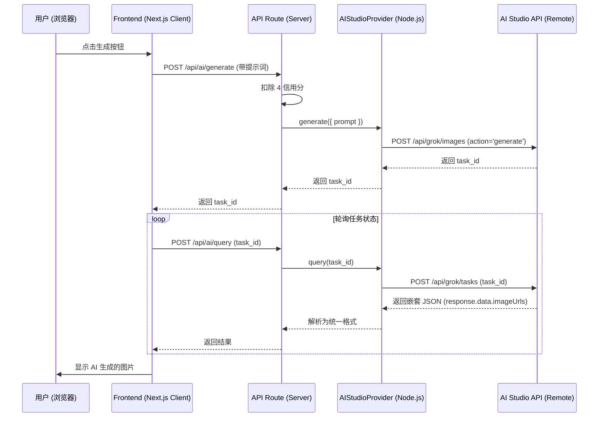

# AI Studio API 全栈对接指南 (Next.js)

基于实际验证通过的接口规范，本指南详细说明了如何在本项目中实现从前端到后端的完整对接逻辑。

---

## 1. 核心协议层 (AI Provider)

**文件路径**: `src/extensions/ai/aistudio.ts`

该文件负责最底层的 API 调用，必须处理 Grok 平台的嵌套响应结构。

### 图片生成请求适配
必须包含 `action: 'generate'` 参数。

```typescript
private async generateImage(params: AIGenerateParams): Promise<AITaskResult> {
  const platform = this.getPlatformByModel(params.model, 'grok');
  const body = {
    action: 'generate', // ✅ 关键：必需参数
    prompt: params.prompt,
    model: params.model,
    size: params.options?.size || '1024x1024',
    count: params.options?.count || 1,
  };
  // ... 发送请求 ...
}
```

### 任务查询响应解析
必须兼容 `response.data` 嵌套结构和 `imageUrls` 字段名。

```typescript
async query(taskId: string): Promise<AITaskResult> {
  const res = await fetch(url, { ... });
  const data = await res.json();

  // ✅ 1. 状态判断逻辑
  let status = AITaskStatus.PENDING;
  if (data.status === 'succeeded' || data.response?.success) {
    status = AITaskStatus.SUCCESS;
  } else if (data.status === 'failed' || (data.finished_at && !data.response?.success)) {
    status = AITaskStatus.FAILED;
  }

  // ✅ 2. 数据提取逻辑 (关键：处理嵌套)
  const resultData = data.response?.data || data;
  const images = resultData.images || 
    (resultData.imageUrls ? resultData.imageUrls.map((url: string) => ({ url })) : null);
  
  return { taskId, taskStatus: status, taskResult: data, taskInfo: { images } };
}
```

---

## 2. 服务端路由层 (API Routes)

**主要文件**: 
- `src/app/api/ai/generate/route.ts` (任务创建)
- `src/app/api/ai/query/route.ts` (状态轮询)

### 任务查询路由关键逻辑
当任务失败时，必须退还用户额度。

```typescript
// src/app/api/ai/query/route.ts 核心伪代码
export async function POST(req: Request) {
  const { taskId } = await req.json();
  const result = await aiService.queryTask(taskId);

  // 如果状态发生变更，更新数据库
  if (result.taskStatus !== cachedStatus) {
    await db.updateTask(taskId, result.taskStatus);
    
    // ✅ 失败退还额度
    if (result.taskStatus === 'failed') {
      await creditService.refund(userId, amount);
    }
  }
  
  return NextResponse.json(result);
}
```

---

## 3. 前端交互层 (Client Components)

**文件路径**: `src/themes/default/blocks/text-to-image/context.tsx`

前端需要实现健壮的轮询逻辑，并能识别多种成功标志。

### 轮询状态识别

```typescript
// 前端轮询中的判断
if (
  data.status === 'success' ||      // ✅ 兼容 Grok/Flux 返回的小写状态
  data.status === 'succeeded' ||    // 兼容标准格式
  data.status === 'SUCCESS'         // 兼容其他 Provider
) {
  setLoading(false);
  setResult(data.taskResult); // 展示图片
}
```

---

## 🔗 数据流全览



---

## 💡 常见错误排查

1. **一直 Loading?** 
   - 检查前端 `context.tsx` 是否在判断 `data.status === 'success'`。Grok 返回的是小写。
2. **请求 400?** 
   - 检查后端 `aistudio.ts` 是否漏传了 `action: 'generate'`。
3. **图片不显示?** 
   - 检查 `query` 解析逻辑。图片可能在 `response.data.imageUrls` 里，而不是顶层的 `images`。

---

## ✅ 结论

遵循本指南编写代码，可以确保前后端完全对齐 **AI Studio** 的真实协议，避免因为文档陈旧导致的各种“诡异”问题。
