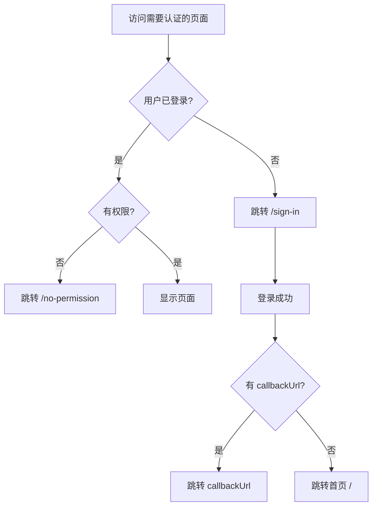
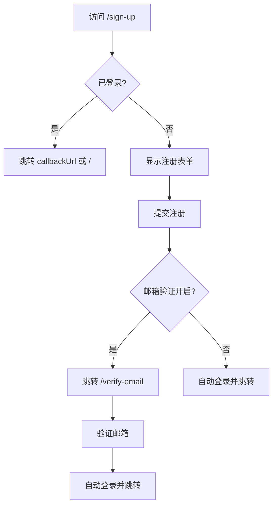
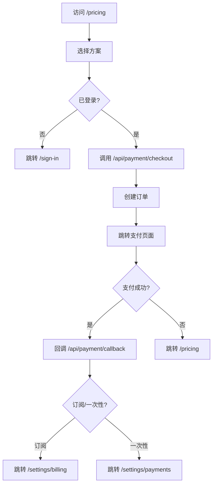
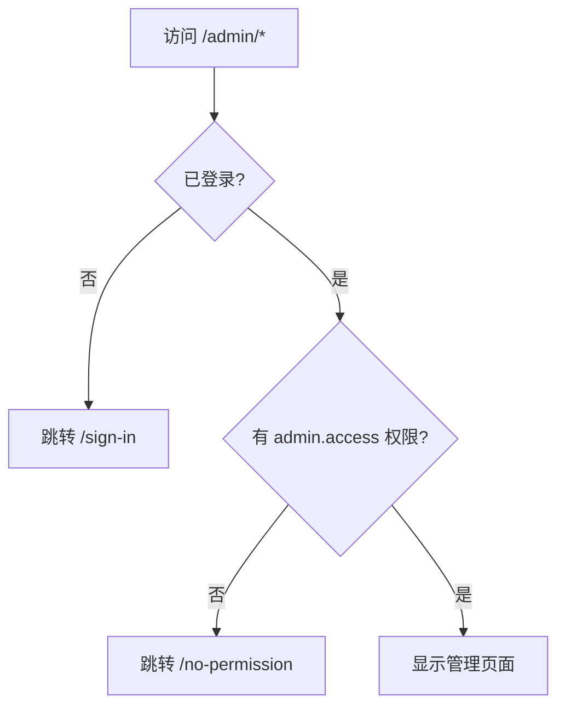
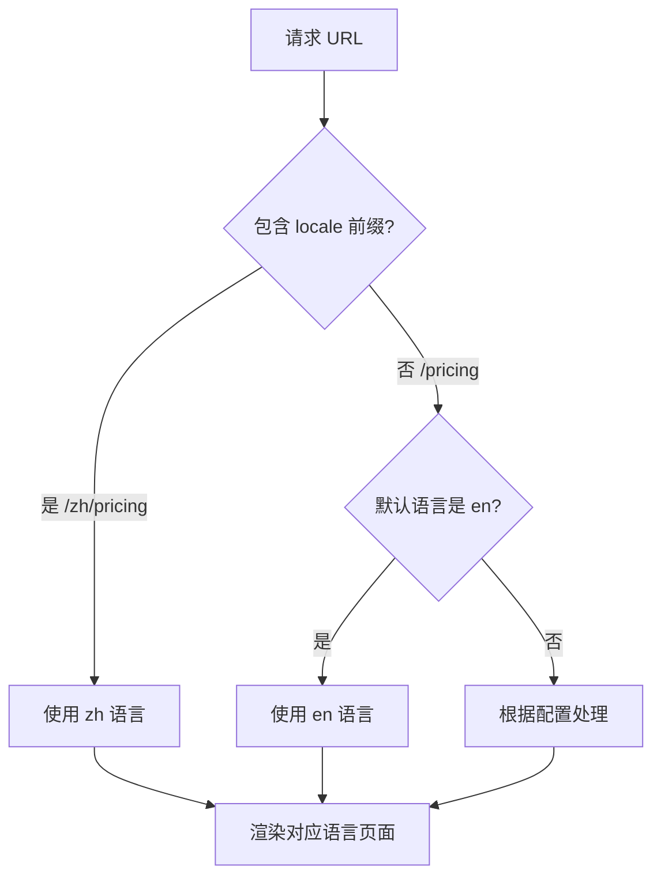
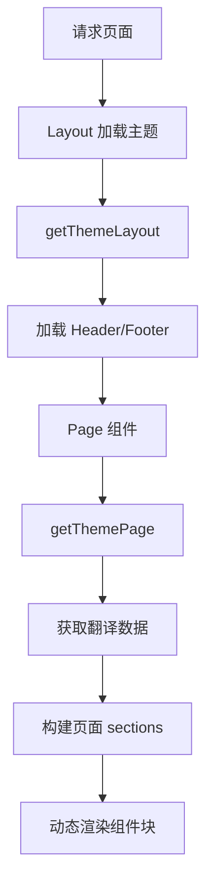
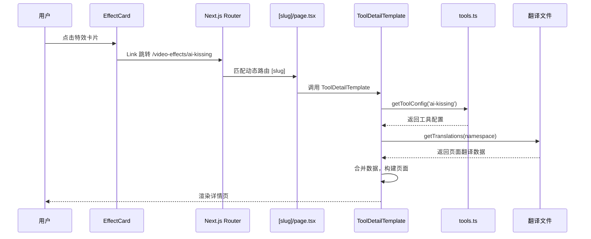

# ShipAny Template 项目分析报告

## 一、项目概述

**项目名称**: shipany-template-two  
**版本**: 1.8.2  
**作者**: ShipAny.ai  
**官网**: https://shipany.ai  
**技术栈**: Next.js 16 + React 19 + TypeScript + Tailwind CSS + Drizzle ORM

这是一个功能完整的 AI SaaS 模板项目，支持多语言国际化、多种支付方式、用户认证、RBAC权限管理等企业级功能。

---

## 二、目录结构总览

```
shipany-template/
├── content/          # MDX 内容文件（文档、博客、更新日志等）
├── public/           # 静态资源文件
├── scripts/          # 工具脚本
├── src/
│   ├── app/          # Next.js App Router 路由
│   ├── config/       # 项目配置
│   ├── core/         # 核心功能模块
│   ├── extensions/   # 扩展功能模块
│   ├── shared/       # 共享组件和工具
│   └── themes/       # 主题系统
└── 配置文件...
```

---

## 三、根目录配置文件详解

### 3.1 package.json
- **作用**: 项目依赖管理和脚本配置
- **主要脚本**:
  - `dev`: 启动开发服务器
  - `build`: 构建生产版本
  - `db:generate/migrate/push/studio`: Drizzle 数据库操作命令
  - `auth:generate`: Better-Auth 认证生成
  - `rbac:init/assign`: RBAC 权限初始化和角色分配
  - `cf:preview/deploy`: Cloudflare 部署命令

### 3.2 next.config.mjs
- **作用**: Next.js 框架配置
- **功能**:
  - 集成 MDX 支持 (fumadocs-mdx)
  - 国际化配置 (next-intl)
  - Bundle 分析器
  - 图片优化配置
  - 缓存策略配置
  - Turbopack 配置

### 3.3 tsconfig.json
- **作用**: TypeScript 编译配置
- **路径别名**:
  - `@/*` → `./src/*`
  - `@/.source` → `./.source/index.ts`

### 3.4 source.config.ts
- **作用**: MDX 内容源配置 (fumadocs-mdx)
- **定义的内容源**:
  - `docs`: 文档 (`content/docs`)
  - `pages`: 页面 (`content/pages`)
  - `posts`: 博客文章 (`content/posts`)
  - `logs`: 更新日志 (`content/logs`)

### 3.5 其他配置文件
| 文件 | 作用 |
|------|------|
| `.env.example` | 环境变量模板 |
| `postcss.config.mjs` | PostCSS 配置 |
| `components.json` | shadcn/ui 组件配置 |
| `vercel.json` | Vercel 部署配置 |
| `Dockerfile` | Docker 容器配置 |
| `wrangler.toml.example` | Cloudflare Workers 配置模板 |

---

## 四、src/app 路由目录详解

### 4.1 根级文件

| 文件 | 作用 |
|------|------|
| `layout.tsx` | **根布局文件**，配置全局字体、广告/分析/联盟/客服脚本注入、UTM捕获、顶部加载进度条 |
| `not-found.tsx` | **404页面**，显示品牌Logo和返回首页按钮 |
| `robots.ts` | **robots.txt生成器**，定义搜索引擎爬虫规则，禁止爬取隐私页面和API路由 |

### 4.2 API 路由 (`src/app/api/`)

#### 4.2.1 认证相关
| 路径 | 作用 |
|------|------|
| `/api/auth/[...all]/route.ts` | Better-Auth 认证处理器，支持邮箱密码、OAuth社交登录，包含速率限制保护 |

#### 4.2.2 支付相关
| 路径 | 作用 |
|------|------|
| `/api/payment/checkout/route.ts` | 结账API，创建支付订单，支持 Stripe/PayPal/Creem，处理多币种和订阅 |
| `/api/payment/callback/` | 支付回调处理 |
| `/api/payment/notify/` | 支付通知 Webhook 处理 |

#### 4.2.3 用户相关
| 路径 | 作用 |
|------|------|
| `/api/user/get-user-info/` | 获取当前用户信息 |
| `/api/user/get-user-credits/` | 获取用户积分余额 |
| `/api/user/is-email-verified/` | 检查邮箱是否已验证 |

#### 4.2.4 聊天相关
| 路径 | 作用 |
|------|------|
| `/api/chat/route.ts` | 聊天主接口 |
| `/api/chat/new/` | 创建新聊天会话 |
| `/api/chat/list/` | 获取聊天列表 |
| `/api/chat/info/` | 获取聊天详情 |
| `/api/chat/messages/` | 获取聊天消息 |

#### 4.2.5 其他 API
| 路径 | 作用 |
|------|------|
| `/api/ai/` | AI 相关 API |
| `/api/config/get-configs/` | 获取系统配置 |
| `/api/docs/search/` | 文档搜索 API |
| `/api/email/send-email/` | 邮件发送 API |
| `/api/storage/upload-image/` | 图片上传 API |
| `/api/proxy/file/` | 文件代理 API |

### 4.3 国际化路由组 (`src/app/[locale]/`)

#### 4.3.1 locale layout.tsx
- **作用**: 国际化布局包装器
- **功能**:
  - 验证 locale 有效性
  - 注入 NextIntlClientProvider
  - 提供 ThemeProvider
  - 提供 AppContextProvider
  - 添加 Toaster 通知组件

#### 4.3.2 (admin) 路由组 - 管理后台
**布局文件**: `(admin)/layout.tsx`
- 权限检查: 需要 `admin.access` 权限
- 使用 DashboardLayout 侧边栏布局

| 页面路径 | 作用 |
|---------|------|
| `/admin` | 管理后台首页 |
| `/admin/users` | 用户管理 |
| `/admin/users/[id]` | 用户详情编辑 |
| `/admin/roles` | 角色管理 |
| `/admin/roles/[id]` | 角色详情 |
| `/admin/permissions` | 权限管理 |
| `/admin/posts` | 文章管理 |
| `/admin/posts/new` | 新建文章 |
| `/admin/posts/[id]` | 编辑文章 |
| `/admin/categories` | 分类管理 |
| `/admin/categories/new` | 新建分类 |
| `/admin/categories/[id]` | 编辑分类 |
| `/admin/payments` | 支付订单管理 |
| `/admin/subscriptions` | 订阅管理 |
| `/admin/credits` | 积分管理 |
| `/admin/apikeys` | API密钥管理 |
| `/admin/settings` | 系统设置 |
| `/admin/ai-tasks` | AI任务管理 |
| `/admin/chats` | 聊天记录管理 |
| `/admin/no-permission` | 无权限提示页 |

#### 4.3.3 (auth) 路由组 - 认证页面
**布局文件**: `(auth)/layout.tsx`
- 居中布局
- 显示品牌Logo、主题切换、语言选择

| 页面路径 | 作用 |
|---------|------|
| `/sign-in` | 登录页面，支持邮箱密码和社交登录 |
| `/sign-up` | 注册页面 |
| `/verify-email` | 邮箱验证页面 |
| `/no-permission` | 无权限提示页 |

#### 4.3.4 (chat) 路由组 - 聊天功能
**布局文件**: `(chat)/layout.tsx`

| 页面路径 | 作用 |
|---------|------|
| `/chat` | 聊天主页 |
| `/chat/[id]` | 具体聊天会话 |
| `/chat/history` | 聊天历史 |

#### 4.3.5 (docs) 路由组 - 文档系统
**布局文件**: `(docs)/layout.tsx`
- 使用 fumadocs-ui DocsLayout

| 页面路径 | 作用 |
|---------|------|
| `/docs/[[...slug]]` | 文档页面，支持动态路由 |

#### 4.3.6 (landing) 路由组 - 营销页面
**布局文件**: `(landing)/layout.tsx`
- 加载主题 Header 和 Footer
- 支持顶部横幅 TopBanner
- 集成语言检测

| 页面路径 | 作用 |
|---------|------|
| `/` | 首页，动态页面组件 |
| `/pricing` | 定价页面，显示订阅方案 |
| `/blog` | 博客列表页 |
| `/blog/[slug]` | 博客详情页 |
| `/blog/category/[slug]` | 博客分类页 |
| `/updates` | 更新日志页 |
| `/showcases` | 案例展示页 |
| `/tools` | 工具列表页 |
| `/tools/[slug]` | 工具详情页 |
| `/photo-effects` | 图片特效列表 |
| `/photo-effects/[slug]` | 图片特效详情 |
| `/video-effects` | 视频特效列表 |
| `/video-effects/[slug]` | 视频特效详情 |
| `/ai-image-generator` | AI图片生成器 |
| `/ai-video-generator` | AI视频生成器 |
| `/ai-music-generator` | AI音乐生成器 |
| `/help` | 帮助中心 |
| `/api-platform` | API平台介绍 |
| `/privacy-policy` | 隐私政策 |
| `/terms-of-service` | 服务条款 |
| `/[...slug]` | 动态捕获页面 |

**用户设置子路由 (`/settings/`)**:
| 页面路径 | 作用 |
|---------|------|
| `/settings` | 重定向到 profile |
| `/settings/profile` | 个人资料设置 |
| `/settings/security` | 安全设置 |
| `/settings/billing` | 账单管理 |
| `/settings/billing/cancel` | 取消订阅 |
| `/settings/billing/upgrade` | 升级订阅 |
| `/settings/payments` | 支付记录 |
| `/settings/credits` | 积分记录 |
| `/settings/invoices` | 发票管理 |
| `/settings/apikeys` | API密钥 |
| `/settings/apikeys/new` | 创建API密钥 |
| `/settings/apikeys/[id]` | 编辑API密钥 |

**活动记录子路由 (`/activity/`)**:
| 页面路径 | 作用 |
|---------|------|
| `/activity` | 活动概览 |
| `/activity/ai-tasks` | AI任务列表 |
| `/activity/ai-tasks/[id]` | AI任务详情 |
| `/activity/chats` | 聊天记录 |
| `/activity/feedbacks` | 反馈记录 |

#### 4.3.7 (tools) 路由组 - AI工具页面
**布局文件**: `(tools)/layout.tsx`

| 页面路径 | 作用 |
|---------|------|
| `/ai-style` | AI风格转换工具 |
| `/image-to-image` | 图生图工具 |
| `/image-to-video` | 图生视频工具 |
| `/text-to-image` | 文生图工具 |
| `/text-to-video` | 文生视频工具 |

---

## 五、src/config 配置目录详解

### 5.1 index.ts
- **作用**: 环境变量配置导出
- **配置项**:
  - 应用基本信息 (URL、名称、Logo等)
  - 数据库连接配置
  - 认证配置
  - 主题和语言设置

### 5.2 db/ 数据库配置
| 文件 | 作用 |
|------|------|
| `schema.ts` | 数据库 schema 导出入口 |
| `schema.postgres.ts` | PostgreSQL schema 定义 |
| `schema.mysql.ts` | MySQL schema 定义 |
| `schema.sqlite.ts` | SQLite/Turso schema 定义 |

### 5.3 locale/ 国际化配置
| 文件 | 作用 |
|------|------|
| `index.ts` | 语言配置 (支持 en/zh)，定义所有翻译文件路径 |
| `messages/` | 翻译文件目录 |

### 5.4 style/ 样式配置
| 文件 | 作用 |
|------|------|
| `global.css` | 全局样式 |
| `theme.css` | 主题变量 |
| `docs.css` | 文档样式 |

### 5.5 theme/ 主题配置
| 文件 | 作用 |
|------|------|
| `index.ts` | 默认主题配置 |

---

## 六、src/core 核心功能目录详解

### 6.1 auth/ 认证模块
| 文件 | 作用 |
|------|------|
| `index.ts` | 认证入口，获取 Better-Auth 实例 |
| `config.ts` | 认证配置，包括社交登录、邮箱验证、新用户积分/角色授予 |
| `client.ts` | 客户端认证工具 |

### 6.2 db/ 数据库模块
| 文件 | 作用 |
|------|------|
| `index.ts` | 数据库入口，自动选择数据库提供商，提供跨数据库兼容层 |
| `postgres.ts` | PostgreSQL 连接管理 |
| `mysql.ts` | MySQL 连接管理 |
| `sqlite.ts` | SQLite/Turso 连接管理 |
| `config.ts` | Drizzle 配置 |

### 6.3 i18n/ 国际化模块
| 文件 | 作用 |
|------|------|
| `config.ts` | next-intl 路由配置 |
| `navigation.ts` | 国际化导航工具 |
| `request.ts` | 请求语言处理 |

### 6.4 rbac/ 权限控制模块
| 文件 | 作用 |
|------|------|
| `index.ts` | 导出入口 |
| `permission.ts` | 权限检查函数，包括 requirePermission、requireRole、requireAdminAccess 等 |

**权限常量**:
```typescript
PERMISSIONS = {
  ADMIN_ACCESS: 'admin.access',
  USERS_READ/WRITE/DELETE,
  POSTS_READ/WRITE/DELETE,
  CATEGORIES_READ/WRITE/DELETE,
  PAYMENTS_READ,
  SUBSCRIPTIONS_READ,
  CREDITS_READ/WRITE,
  APIKEYS_READ/WRITE/DELETE,
  SETTINGS_READ/WRITE,
  ROLES_READ/WRITE/DELETE,
  PERMISSIONS_READ/WRITE/DELETE,
  AITASKS_READ/WRITE/DELETE,
}
```

### 6.5 docs/ 文档模块
| 文件 | 作用 |
|------|------|
| `source.ts` | fumadocs 文档源配置 |
| `toc.ts` | 目录生成 |

### 6.6 theme/ 主题模块
| 文件 | 作用 |
|------|------|
| `index.ts` | 主题加载器，支持动态加载主题页面/布局/组件块 |
| `provider.tsx` | 主题 Provider (next-themes) |

---

## 七、src/extensions 扩展模块详解

### 7.1 ai/ AI 服务扩展
| 文件 | 作用 |
|------|------|
| `index.ts` | AI Manager 管理器，管理多个 AI Provider |
| `types.ts` | AI 类型定义 |
| `replicate.ts` | Replicate AI 服务实现 |
| `gemini.ts` | Google Gemini AI 服务实现 |
| `fal.ts` | Fal.ai 服务实现 |
| `kie.ts` | Kie AI 服务实现 |

### 7.2 payment/ 支付扩展
| 文件 | 作用 |
|------|------|
| `index.ts` | Payment Manager 管理器 |
| `types.ts` | 支付类型定义 (订单、价格、订阅等) |
| `stripe.ts` | Stripe 支付实现 |
| `paypal.ts` | PayPal 支付实现 |
| `creem.ts` | Creem 支付实现 |

### 7.3 storage/ 存储扩展
| 文件 | 作用 |
|------|------|
| `index.ts` | 存储入口 |
| `r2.ts` | Cloudflare R2 存储实现 |
| `s3.ts` | AWS S3 存储实现 |

### 7.4 email/ 邮件扩展
| 文件 | 作用 |
|------|------|
| `index.ts` | 邮件入口 |
| `resend.ts` | Resend 邮件服务实现 |

### 7.5 analytics/ 分析扩展
| 文件 | 作用 |
|------|------|
| `index.tsx` | 分析入口 |
| `google-analytics.tsx` | Google Analytics 实现 |
| `vercel-analytics.tsx` | Vercel Analytics 实现 |
| `plausible.tsx` | Plausible 实现 |
| `clarity.tsx` | Microsoft Clarity 实现 |
| `open-panel.tsx` | OpenPanel 实现 |

### 7.6 ads/ 广告扩展
| 文件 | 作用 |
|------|------|
| `index.tsx` | 广告入口 |
| `adsense.tsx` | Google AdSense 实现 |

### 7.7 affiliate/ 联盟扩展
| 文件 | 作用 |
|------|------|
| `index.tsx` | 联盟入口 |
| `promotekit.tsx` | PromoteKit 实现 |
| `affonso.tsx` | Affonso 实现 |

### 7.8 customer-service/ 客服扩展
| 文件 | 作用 |
|------|------|
| `index.tsx` | 客服入口 |
| `crisp.tsx` | Crisp 客服实现 |
| `tawk.tsx` | Tawk.to 客服实现 |

---

## 八、src/shared 共享目录详解

### 8.1 blocks/ 业务组件块

#### 8.1.1 common/ 通用组件
| 文件 | 作用 |
|------|------|
| `audio-player.tsx` | 音频播放器 |
| `brand-logo.tsx` | 品牌Logo组件 |
| `built-with.tsx` | "Built with" 标识 |
| `copyright.tsx` | 版权信息 |
| `crumb.tsx` | 面包屑导航 |
| `empty.tsx` | 空状态组件 |
| `error-boundary.tsx` | 错误边界 |
| `image-uploader.tsx` | 图片上传器 |
| `lazy-image.tsx` | 懒加载图片 |
| `locale-detector.tsx` | 语言检测器 |
| `locale-selector.tsx` | 语言选择器 |
| `markdown-content.tsx` | Markdown 内容渲染 |
| `markdown-editor.tsx` | Markdown 编辑器 |
| `markdown-preview.tsx` | Markdown 预览 |
| `mdx-content.tsx` | MDX 内容渲染 |
| `page-header.tsx` | 页面头部 |
| `pagination.tsx` | 分页组件 |
| `section-header.tsx` | 区块头部 |
| `smart-icon.tsx` | 智能图标 (支持 Lucide/Tabler) |
| `tabs.tsx` | 标签页 |
| `theme-toggler.tsx` | 主题切换 |
| `top-banner.tsx` | 顶部横幅 |
| `utm-capture.tsx` | UTM 参数捕获 |

#### 8.1.2 sign/ 认证组件
| 文件 | 作用 |
|------|------|
| `sign-in.tsx` | 登录表单组件 |
| `sign-in-form.tsx` | 登录表单逻辑 |
| `sign-up.tsx` | 注册表单组件 |
| `sign-modal.tsx` | 登录弹窗 |
| `sign-user.tsx` | 用户头像菜单 |
| `social-providers.tsx` | 社交登录按钮 |
| `verify-email.tsx` | 邮箱验证组件 |

#### 8.1.3 dashboard/ 仪表盘组件
| 文件 | 作用 |
|------|------|
| `layout.tsx` | 仪表盘布局 |
| `header.tsx` | 仪表盘头部 |
| `main-header.tsx` | 主内容区头部 |
| `sidebar.tsx` | 侧边栏容器 |
| `sidebar-header.tsx` | 侧边栏头部 |
| `sidebar-footer.tsx` | 侧边栏底部 |
| `sidebar-user.tsx` | 侧边栏用户信息 |
| `sidebar-buttons.tsx` | 侧边栏按钮 |
| `nav.tsx` | 导航菜单 |
| `search.tsx` | 搜索组件 |
| `filter.tsx` | 筛选组件 |
| `main.tsx` | 主内容区 |
| `form-card.tsx` | 表单卡片 |

#### 8.1.4 其他业务组件
| 目录 | 作用 |
|------|------|
| `chat/` | 聊天相关组件 (9个文件) |
| `console/` | 控制台组件 |
| `email/` | 邮件模板组件 |
| `form/` | 表单组件 (8个文件) |
| `generator/` | 生成器组件 (4个文件) |
| `panel/` | 面板组件 |
| `payment/` | 支付组件 |
| `table/` | 表格组件 (9个文件) |

### 8.2 components/ 基础组件

#### 8.2.1 ui/ UI 基础组件 (46个)
基于 shadcn/ui 和 Radix UI 的组件库:
- 布局: `card`, `sidebar`, `sheet`, `dialog`, `drawer`
- 表单: `input`, `textarea`, `select`, `checkbox`, `radio-group`, `switch`, `form`
- 导航: `navigation-menu`, `breadcrumb`, `tabs`, `pagination`
- 数据展示: `table`, `accordion`, `avatar`, `badge`, `progress`
- 反馈: `tooltip`, `hover-card`, `sonner`(Toast)
- 动画: `animated-group`, `animated-grid-pattern`, `text-effect`, `marquee`, `infinite-slider`
- 其他: `button`, `button-group`, `dropdown-menu`, `command`, `collapsible`

#### 8.2.2 magicui/ 魔法UI组件 (8个)
动画和特效组件

#### 8.2.3 ai-elements/ AI元素组件 (11个)
AI 相关的可视化组件

### 8.3 models/ 数据模型
| 文件 | 作用 |
|------|------|
| `user.ts` | 用户模型，获取用户信息 |
| `config.ts` | 系统配置模型 |
| `order.ts` | 订单模型，支付订单管理 |
| `subscription.ts` | 订阅模型 |
| `credit.ts` | 积分模型，积分记录和消费 |
| `apikey.ts` | API密钥模型 |
| `chat.ts` | 聊天模型 |
| `chat_message.ts` | 聊天消息模型 |
| `ai_task.ts` | AI任务模型 |
| `post.tsx` | 文章模型 |
| `taxonomy.ts` | 分类模型 |

### 8.4 services/ 业务服务
| 文件 | 作用 |
|------|------|
| `payment.ts` | 支付服务，初始化支付提供商 |
| `rbac.ts` | RBAC 服务，权限和角色管理 |
| `settings.ts` | 设置服务，系统配置管理 |
| `ai.ts` | AI 服务，初始化 AI 提供商 |
| `storage.ts` | 存储服务 |
| `email.ts` | 邮件服务 |
| `analytics.ts` | 分析服务 |
| `ads.ts` | 广告服务 |
| `affiliate.ts` | 联盟服务 |
| `customer_service.tsx` | 客服服务 |

### 8.5 lib/ 工具函数
| 文件 | 作用 |
|------|------|
| `hash.ts` | 哈希工具 (UUID、SnowflakeID) |
| `cookies.ts` | Cookie 工具 |
| `cache.ts` | 缓存工具 |
| `seo.ts` | SEO 元数据生成 |
| `resp.ts` | API 响应工具 |
| `rate-limit.ts` | 速率限制 |
| `ip.ts` | IP 地址获取 |
| `time.ts` | 时间工具 |
| `browser.ts` | 浏览器检测 |
| `env.ts` | 环境检测 |
| `utils.ts` | 通用工具 |

### 8.6 其他目录
| 目录 | 作用 |
|------|------|
| `contexts/` | React Context (AppContext) |
| `hooks/` | 自定义 Hooks (3个) |
| `types/` | TypeScript 类型定义 |

---

## 九、src/themes 主题目录详解

### 9.1 default/ 默认主题

#### 9.1.1 layouts/
| 文件 | 作用 |
|------|------|
| `landing.tsx` | 营销页面布局 |

#### 9.1.2 pages/
| 文件 | 作用 |
|------|------|
| `dynamic-page.tsx` | 动态页面渲染 |
| 其他页面组件 | ... |

#### 9.1.3 blocks/ 主题组件块 (37个)
| 文件 | 作用 |
|------|------|
| `header.tsx` | 页面头部导航 |
| `footer.tsx` | 页面底部 |
| `hero.tsx` | 首页 Hero 区块 |
| `features.tsx` | 功能特性展示 |
| `features-accordion.tsx` | 手风琴式功能展示 |
| `features-flow.tsx` | 流程式功能展示 |
| `features-list.tsx` | 列表式功能展示 |
| `features-media.tsx` | 媒体功能展示 |
| `features-step.tsx` | 步骤式功能展示 |
| `feature-split.tsx` | 分栏式功能展示 |
| `pricing.tsx` | 定价组件 |
| `faq.tsx` | 常见问题 |
| `cta.tsx` | 行动号召 |
| `testimonials.tsx` | 用户评价 |
| `logos.tsx` | 合作伙伴 Logo |
| `stats.tsx` | 统计数据 |
| `subscribe.tsx` | 订阅表单 |
| `social-avatars.tsx` | 社交头像 |
| `blog.tsx` | 博客列表 |
| `blog-detail.tsx` | 博客详情 |
| `updates.tsx` | 更新日志 |
| `showcases.tsx` | 案例展示 |
| `showcases-flow.tsx` | 流程式案例展示 |
| `inspirations.tsx` | 灵感展示 |
| `creations-section.tsx` | 创作展示 |
| `models-section.tsx` | 模型展示 |
| `effects-section.tsx` | 特效展示 |
| `effect-card.tsx` | 特效卡片 |
| `related-effects.tsx` | 相关特效 |
| `related-tools.tsx` | 相关工具 |
| `tool-content.tsx` | 工具内容 |
| `tool-sidebar.tsx` | 工具侧边栏 |
| `tool-detail-layout.tsx` | 工具详情布局 |
| `tool-bottom-sections.tsx` | 工具底部区块 |
| `video-tool.tsx` | 视频工具 |
| `page-detail.tsx` | 页面详情 |

---

## 十、scripts 脚本目录详解

| 文件/目录 | 作用 |
|---------|------|
| `with-env.ts` | 环境变量加载器，用于运行其他脚本前加载 .env |
| `init-rbac.ts` | RBAC 初始化脚本，创建默认角色和权限 |
| `assign-role.ts` | 角色分配脚本，为用户分配角色 |
| `fix-effects-urls/` | URL 修复工具脚本 |

---

## 十一、content 内容目录详解

| 目录 | 作用 |
|------|------|
| `docs/` | 文档 MDX 文件 (支持 en/zh) |
| `posts/` | 博客文章 MDX 文件 |
| `pages/` | 静态页面 MDX (关于、隐私政策、服务条款) |
| `logs/` | 更新日志 MDX 文件 |

---

## 十二、页面跳转逻辑分析

### 12.1 认证流程



### 12.2 注册流程



### 12.3 支付流程



### 12.4 管理后台访问流程



### 12.5 用户设置导航

```mermaid
graph TD
    A[/settings] --> B[重定向 /settings/profile]
    B --> C{已登录?}
    C -->|否| D[跳转 /sign-in]
    C -->|是| E[显示设置页面]
    E --> F[侧边栏导航]
    F --> G[/settings/profile]
    F --> H[/settings/security]
    F --> I[/settings/billing]
    F --> J[/settings/payments]
    F --> K[/settings/credits]
    F --> L[/settings/apikeys]
```

### 12.6 国际化路由逻辑



### 12.7 动态页面渲染流程



---

## 十三、Effects 卡片跳转详情页实现详解

本章节详细说明用户点击 Effects 卡片后如何跳转到对应详情页的完整实现逻辑。

### 13.1 整体架构流程

```mermaid
graph TD
    A[用户点击 Effect 卡片] --> B[EffectCard 组件]
    B --> C{读取 item.url}
    C --> D[Link 组件导航]
    D --> E{URL 路径判断}
    E -->|/video-effects/slug| F[video-effects/[slug]/page.tsx]
    E -->|/photo-effects/slug| G[photo-effects/[slug]/page.tsx]
    F --> H[ToolDetailTemplate]
    G --> H
    H --> I[从 tools.ts 获取工具配置]
    I --> J[渲染详情页]
```

### 13.2 核心文件及作用

| 文件路径 | 作用 |
|---------|------|
| `src/data/tools.ts` | **数据源**：定义所有工具的 slug、类型、特效项目列表，是跳转 URL 的唯一真实来源 |
| `src/themes/default/blocks/effect-card.tsx` | **卡片组件**：渲染单个特效卡片，包含跳转链接 |
| `src/themes/default/blocks/effects-section.tsx` | **列表组件**：渲染特效卡片网格，遍历调用 EffectCard |
| `src/app/[locale]/(landing)/photo-effects/[slug]/page.tsx` | **图片特效详情页路由** |
| `src/app/[locale]/(landing)/video-effects/[slug]/page.tsx` | **视频特效详情页路由** |
| `src/themes/default/templates/ToolDetailTemplate.tsx` | **详情页模板**：统一处理详情页渲染逻辑 |

### 13.3 数据流详解

#### 13.3.1 tools.ts 数据结构

```typescript
// src/data/tools.ts
export interface Tool {
  slug: string;      // URL 路径标识，如 'ai-kissing'
  title: string;     // 显示标题
  type: ToolType;    // 'video' | 'photo'
  items: ToolItem[]; // 该工具下的所有特效项目
}

export interface ToolItem {
  title: string;        // 特效名称
  originalSrc: string;  // 原图路径
  effectSrc: string;    // 效果图路径
  videoSrc?: string;    // 视频路径（可选）
  badge?: string;       // 标签如 'HOT', 'NEW'
}
```

#### 13.3.2 URL 生成规则

根据工具类型 (type) 生成不同的 URL 前缀：
- **视频特效**: `/video-effects/{slug}`
- **图片特效**: `/photo-effects/{slug}`

示例：
```typescript
const detailUrl = tool.type === 'video' 
  ? `/video-effects/${tool.slug}` 
  : `/photo-effects/${tool.slug}`;
// 如: /video-effects/ai-kissing 或 /photo-effects/hug-generator
```

### 13.4 EffectCard 组件实现

```typescript
// src/themes/default/blocks/effect-card.tsx
export function EffectCard({ item, itemsLabel, buttonText }: {...}) {
  return (
    <Link
      href={item.url || '#'}  // 跳转目标 URL
      onMouseEnter={handleMouseEnter}
      onMouseLeave={handleMouseLeave}
      className="group relative aspect-[4/5] rounded-3xl overflow-hidden cursor-pointer block"
    >
      {/* 原图展示 */}
      {originalImage && (
        <Image src={originalImage} alt={item.title} fill ... />
      )}
      
      {/* 效果图 - 鼠标悬停显示 (图片特效) */}
      {effectImage && !hasVideo && (
        <Image src={effectImage} className="opacity-0 group-hover:opacity-100" ... />
      )}
      
      {/* 视频 - 鼠标悬停播放 (视频特效) */}
      {hasVideo && (
        <video src={videoSrc} className="opacity-0 group-hover:opacity-100" ... />
      )}
      
      {/* 标题和按钮 */}
      ...
    </Link>
  );
}
```

**关键点**：
1. 使用 `@/core/i18n/navigation` 的 `Link` 组件实现国际化路由
2. `item.url` 来自配置数据，格式为 `/video-effects/slug` 或 `/photo-effects/slug`
3. 鼠标悬停时显示效果预览（图片切换或视频播放）

### 13.5 EffectsSection 组件实现

```typescript
// src/themes/default/blocks/effects-section.tsx
export function EffectsSection({ section, className }: {...}) {
  const [activeTab, setActiveTab] = useState(section.tabs?.[0]?.id || 'video');

  return (
    <section>
      {/* Tab 切换按钮 */}
      <div className="flex flex-wrap justify-center gap-2">
        {section.tabs?.map((tab: TabData) => (
          <button onClick={() => setActiveTab(tab.id)} ...>
            {tab.label}
          </button>
        ))}
      </div>

      {/* 卡片网格 */}
      <div className="grid grid-cols-2 md:grid-cols-3 lg:grid-cols-5 gap-4">
        {section.tabs
          ?.find((t: TabData) => t.id === activeTab)
          ?.items.map((item: EffectItem, index: number) => (
            <EffectCard 
              key={index} 
              item={item}  // 包含 url 属性
              itemsLabel={section.items_label} 
              buttonText={section.button_text}
            />
          ))}
      </div>
    </section>
  );
}
```

### 13.6 详情页路由处理

#### 13.6.1 动态路由文件

```typescript
// src/app/[locale]/(landing)/video-effects/[slug]/page.tsx
export default function VideoEffectDetailPage({
  params,
  searchParams,
}: {
  params: Promise<{ locale: string; slug: string }>;
  searchParams: Promise<{ type?: string }>;
}) {
  return (
    <ToolDetailTemplate 
      params={params} 
      namespace="pages.video-effect-details"  // 翻译命名空间
      searchParams={searchParams}
    />
  );
}
```

#### 13.6.2 ToolDetailTemplate 模板处理

```typescript
// src/themes/default/templates/ToolDetailTemplate.tsx
export async function ToolDetailTemplate({ params, namespace, searchParams }) {
  const { locale, slug } = await params;
  
  // 1. 从翻译文件获取页面数据
  const t = await getTranslations({ locale, namespace });
  if (!t.has(slug)) {
    return notFound();  // slug 不存在则返回 404
  }
  
  const effectData = t.raw(slug);
  
  // 2. 从 tools.ts 获取工具配置
  const toolConfig = getToolConfig(slug);
  
  // 3. 转换数据格式
  let examples = toolConfig?.items.map((item) => ({
    category: item.title,
    prompt: `Generate ${item.title} effect`,
    image: item.effectSrc,
    video: item.videoSrc,
  })) || [];
  
  // 4. 构建相关工具列表（排除当前工具）
  const relatedTools = tools.filter(t => 
    t.type === toolType && t.slug !== slug
  );
  
  // 5. 渲染详情页
  return (
    <ToolDetailLayout>
      <ToolContent
        toolName={effectData.page.title}
        examples={examples}
        toolType={toolType}
        ...
      />
    </ToolDetailLayout>
  );
}
```

### 13.7 完整跳转流程图



### 13.8 URL 配置来源说明

**重要**：卡片的 `url` 属性有两种配置来源：

#### 来源一：JSON 翻译文件（首页/列表页）
```json
// src/config/locale/messages/en/pages/index.json
{
  "tabs": [{
    "id": "video",
    "label": "Video Effects",
    "items": [{
      "title": "AI Kissing",
      "url": "/video-effects/ai-kissing",  // 直接配置 URL
      "image": {...}
    }]
  }]
}
```

#### 来源二：代码动态生成（详情页底部推荐）
```typescript
// src/themes/default/templates/ToolDetailTemplate.tsx
const effectsGridProps = {
  items: relatedTools.map(t => ({
    title: t.title,
    // 根据 tools.ts 中的 type 动态生成 URL
    url: toolType === 'video' 
      ? `/video-effects/${t.slug}` 
      : `/photo-effects/${t.slug}`,
  }))
};
```

### 13.9 关键约束：URL 必须与 tools.ts 的 slug 一致

为避免 404 错误，所有 Effect 卡片的 URL 必须满足：

1. **URL 格式**: `/video-effects/{slug}` 或 `/photo-effects/{slug}`
2. **slug 来源**: 必须是 `src/data/tools.ts` 中定义的有效 slug
3. **类型匹配**: video 类型工具使用 `/video-effects/`，photo 类型使用 `/photo-effects/`

```typescript
// tools.ts 中定义的有效 slugs 示例
const tools = [
  { slug: 'ai-kissing', type: 'video', ... },
  { slug: 'ai-muscle', type: 'video', ... },
  { slug: 'hug-generator', type: 'photo', ... },
  { slug: 'ai-kissing-photo', type: 'photo', ... },
  // ...
];
```

### 13.10 调试技巧

当点击卡片出现 404 时，检查以下几点：

1. 检查 `item.url` 的值是否正确
2. 确认 URL 中的 slug 在 `tools.ts` 中存在
3. 确认 slug 对应的 type 与 URL 前缀匹配
4. 确认翻译文件中存在对应的 `namespace.slug` 配置

---

## 十四、关键技术架构总结

### 13.1 多数据库支持
- PostgreSQL (默认)
- MySQL
- SQLite/Turso

### 13.2 多支付提供商
- Stripe
- PayPal
- Creem

### 13.3 多 AI 提供商
- Replicate
- Google Gemini
- Fal.ai
- Kie

### 13.4 权限系统 (RBAC)
- 基于角色的访问控制
- 细粒度权限管理
- 新用户自动角色分配

### 13.5 国际化
- 支持多语言 (en/zh)
- 基于文件的翻译管理
- URL 路由国际化

### 13.6 主题系统
- 可替换主题
- 组件块动态加载
- 页面/布局/组件块分离

---

## 十四、总结

ShipAny Template 是一个功能完整、架构清晰的 AI SaaS 模板项目。它采用了现代化的技术栈和最佳实践，提供了：

1. **完整的用户系统**: 注册、登录、邮箱验证、OAuth社交登录
2. **灵活的支付系统**: 支持多种支付方式和订阅模式
3. **强大的权限管理**: RBAC 角色权限控制
4. **多语言支持**: 完整的国际化方案
5. **可扩展的架构**: 模块化的扩展系统
6. **丰富的 UI 组件**: 基于 shadcn/ui 的组件库
7. **SEO 友好**: 服务端渲染、元数据管理
8. **主题系统**: 可定制的主题方案

该模板适合快速构建 AI SaaS 产品，大幅减少开发时间和成本。
